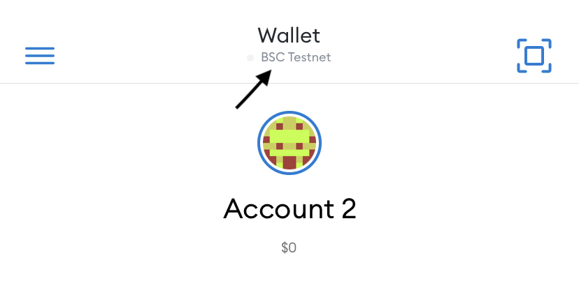

# Creo Farm Ui

## How to set up test environment (metamask):

Download Metamask For Mobile/PC here https://metamask.io/

### 1) Navigate to Metamask -> Settings -> Networks, click on add Network.

#### Mobile


#### Web


### 2) Input the following variables as shown below

```
Network Name : BSC Testnet
New RPC URL : https://data-seed-prebsc-1-s1.binance.org:8545
Chain ID : 97
Currency Symbol: BNB
Block Explorer: https://testnet.bscscan.com/
```

#### Mobile


#### Web


### 3) Switch to bsc testnet as shown below

#### Mobile
1. Click on the current network shown on top section of your wallet



2. Select Bsc testnet


#### Web

1. Click on the current network shown on top section of your wallet


2. Select Bsc testnet


### 3) Get free testnet bnb for transactions from [here](https://testnet.binance.org/faucet-smart). Paste in your wallet and claim testnet bnb.


### Note: Testnet Creo token and  testnet creo lp token will be airdropped to users that requested access to farm testnet.